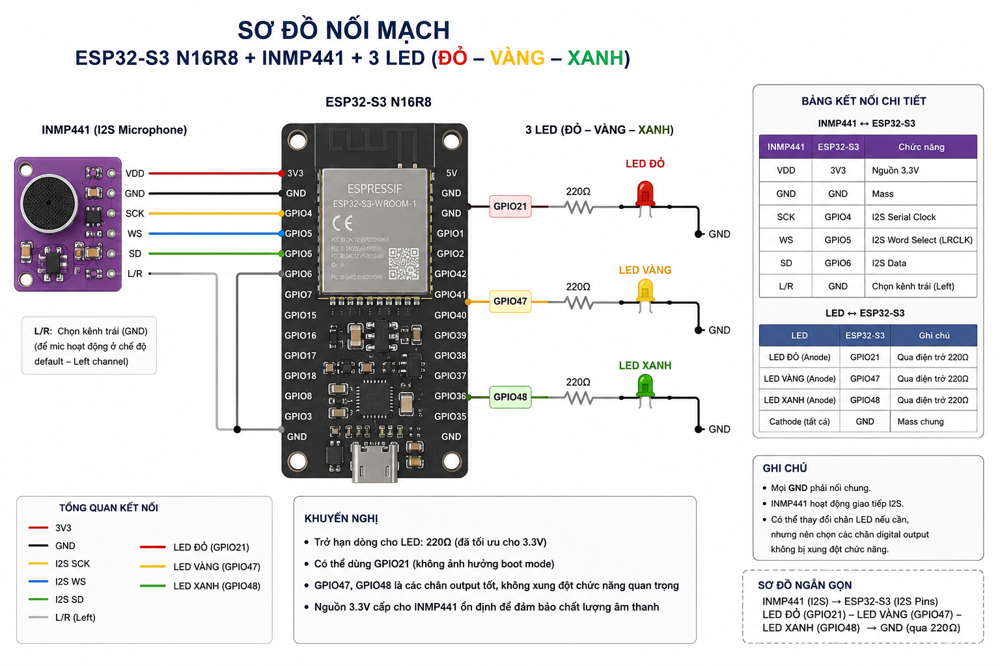
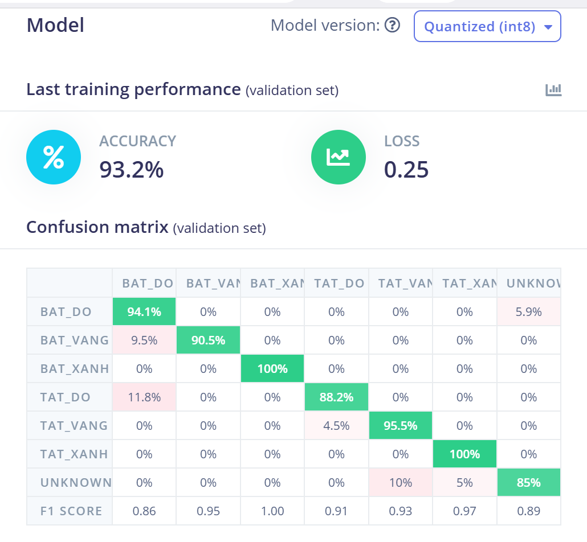
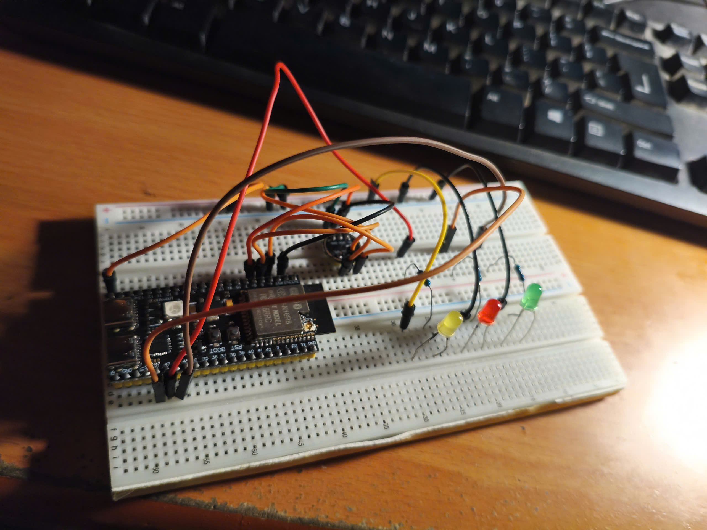

# HỆ THỐNG ĐIỀU KHIỂN LED BẰNG GIỌNG NÓI SỬ DỤNG ESP32-S3

## 1. Giới thiệu

Đề tài xây dựng một hệ thống điều khiển LED bằng giọng nói sử dụng vi điều khiển ESP32-S3 và microphone INMP441.

Âm thanh từ người dùng được thu qua microphone INMP441, sau đó ESP32-S3 xử lý tín hiệu âm thanh và sử dụng mô hình Machine Learning được huấn luyện trên Edge Impulse để nhận diện câu lệnh.

Hệ thống có khả năng nhận diện các lệnh điều khiển LED như:

* `bat_do`
* `tat_do`
* `bat_vang`
* `tat_vang`
* `bat_xanh`
* `tat_xanh`

Sau khi nhận diện câu lệnh, ESP32-S3 thực hiện thao tác tương ứng với LED.

---

## 2. Mục tiêu đề tài

* Thu âm giọng nói bằng microphone INMP441.
* Xử lý tín hiệu âm thanh trên ESP32-S3.
* Xây dựng bộ dữ liệu cho các câu lệnh.
* Huấn luyện mô hình nhận dạng giọng nói bằng Edge Impulse.
* Đưa mô hình AI lên ESP32-S3.
* Điều khiển các LED bằng câu lệnh giọng nói.
* Đánh giá khả năng nhận diện của hệ thống trong thực tế.

---

## 3. Phần cứng

| STT | Thiết bị       | Chức năng                    |
| --- | -------------- | ---------------------------- |
| 1   | ESP32-S3 N16R8 | Vi điều khiển và xử lý AI    |
| 2   | INMP441        | Thu tín hiệu âm thanh        |
| 3   | LED đỏ         | Hiển thị trạng thái LED đỏ   |
| 4   | LED vàng       | Hiển thị trạng thái LED vàng |
| 5   | LED xanh       | Hiển thị trạng thái LED xanh |

---

## 4. Sơ đồ hệ thống


<p align="center">
  
</p>
Hệ thống gồm ba khối chính:

**Microphone INMP441 → ESP32-S3 → Mô hình AI → LED**

Microphone thu âm thanh từ người dùng. ESP32-S3 lấy dữ liệu âm thanh thông qua giao tiếp I2S và đưa dữ liệu vào mô hình nhận dạng giọng nói.

Dựa trên kết quả nhận diện, ESP32-S3 điều khiển LED tương ứng.

---

## 5. Kết nối INMP441

INMP441 được kết nối với ESP32-S3 thông qua giao tiếp I2S.

| INMP441 | ESP32-S3 |
| ------- | -------- |
| VDD     | 3.3V     |
| GND     | GND      |
| SCK     | GPIO 4   |
| WS      | GPIO 5   |
| SD      | GPIO 6   |

---

## 6. Bộ dữ liệu

Để xây dựng mô hình nhận dạng giọng nói, bộ dữ liệu được thu thập với các câu lệnh điều khiển tương ứng với ba LED đỏ, vàng và xanh. Các câu lệnh được sử dụng trong quá trình huấn luyện gồm:

* `bat_do` – bật LED đỏ
* `tat_do` – tắt LED đỏ
* `bat_vang` – bật LED vàng
* `tat_vang` – tắt LED vàng
* `bat_xanh` – bật LED xanh
* `tat_xanh` – tắt LED xanh
* `unknown` – các âm thanh hoặc câu lệnh không thuộc các lớp điều khiển trên

Mỗi lớp lệnh điều khiển được thu thập **90 mẫu dữ liệu**, trong khi lớp `unknown` được thu thập **120 mẫu**. Như vậy, tổng số mẫu dữ liệu được sử dụng là:

**6 × 90 + 120 = 660 mẫu**

Chi tiết số lượng dữ liệu của từng lớp được thể hiện trong bảng dưới đây:

| STT | Nhãn | Ý nghĩa | Số lượng mẫu |
|---:|---|---|---:|
| 1 | `bat_do` | Bật LED đỏ | 90 |
| 2 | `tat_do` | Tắt LED đỏ | 90 |
| 3 | `bat_vang` | Bật LED vàng | 90 |
| 4 | `tat_vang` | Tắt LED vàng | 90 |
| 5 | `bat_xanh` | Bật LED xanh | 90 |
| 6 | `tat_xanh` | Tắt LED xanh | 90 |
| 7 | `unknown` | Âm thanh không thuộc các câu lệnh đã định nghĩa | 120 |
| | **Tổng cộng** | | **660** |

Tần số lấy mẫu âm thanh được thiết lập ở mức **16 kHz**, phù hợp với bài toán nhận dạng giọng nói trên vi điều khiển.

Các mẫu âm thanh sau khi thu thập được đưa lên nền tảng **Edge Impulse** để thực hiện quá trình tiền xử lý, trích xuất đặc trưng và huấn luyện mô hình Machine Learning.

Việc bổ sung lớp `unknown` giúp mô hình có khả năng phân biệt các câu lệnh hợp lệ với những âm thanh hoặc câu nói không thuộc các lớp điều khiển, từ đó hạn chế việc hệ thống thực hiện lệnh ngoài ý muốn.

---

## 7. Huấn luyện mô hình bằng Edge Impulse

Quy trình huấn luyện:

1. Thu thập dữ liệu âm thanh.
2. Gán nhãn dữ liệu.
3. Chia dữ liệu thành Training Set và Test Set.
4. Tạo Impulse.
5. Thiết lập Audio / MFCC.
6. Thiết lập Neural Network.
7. Tiến hành Training.
8. Đánh giá độ chính xác.
9. Export mô hình cho ESP32-S3.


<p align="center">
  
</p>
---

## 8. Nguyên lý hoạt động

Khi người dùng phát âm một câu lệnh, microphone INMP441 thu tín hiệu âm thanh.

ESP32-S3 thực hiện:

```text
Thu âm thanh
     ↓
Xử lý tín hiệu I2S
     ↓
Tiền xử lý âm thanh
     ↓
Đưa dữ liệu vào mô hình AI
     ↓
Nhận kết quả phân loại
     ↓
Kiểm tra độ tin cậy
     ↓
Điều khiển LED
```

Ví dụ:

```text
"bật đỏ"
    ↓
Mô hình AI
    ↓
bat_do
    ↓
LED đỏ ON
```

---

## 9. Mã nguồn

Mã nguồn của hệ thống được lưu trong thư mục:

`code/`

Các chương trình kiểm tra phần cứng cũng được lưu riêng để thuận tiện cho việc kiểm thử.

---
## 10. Kết quả

Hệ thống có thể:

- Thu nhận âm thanh từ INMP441.
- Nhận diện các câu lệnh đã được huấn luyện.
- Điều khiển LED tương ứng.
- Hoạt động trực tiếp trên ESP32-S3.

### 10.1 Mô hình thực tế



### 10.2 Kết quả điều khiển LED


---

## 11. Video demo

Video mô phỏng hoạt động của hệ thống:

**[Xem video demo](https://drive.google.com/file/d/1GDWyiwA9YflLM_Tne0BsfbyH1EgVbAPD/view?usp=sharing)**

---

## 12. Kết luận

Đề tài đã xây dựng được hệ thống điều khiển LED bằng giọng nói sử dụng ESP32-S3 và microphone INMP441.

Việc sử dụng Edge Impulse giúp xây dựng và triển khai mô hình Machine Learning trên vi điều khiển. Hệ thống có khả năng nhận diện các câu lệnh được huấn luyện và thực hiện thao tác điều khiển LED tương ứng.

---

## 13. Hướng phát triển

Trong tương lai có thể phát triển hệ thống theo các hướng:

* Tăng số lượng câu lệnh.
* Tăng độ chính xác của mô hình.
* Bổ sung nhiều thiết bị điều khiển.
* Điều khiển relay hoặc thiết bị điện.
* Kết hợp Wi-Fi để điều khiển từ xa.
* Kết hợp nhiều loại cảm biến.
* Tối ưu mô hình để giảm thời gian nhận diện.
