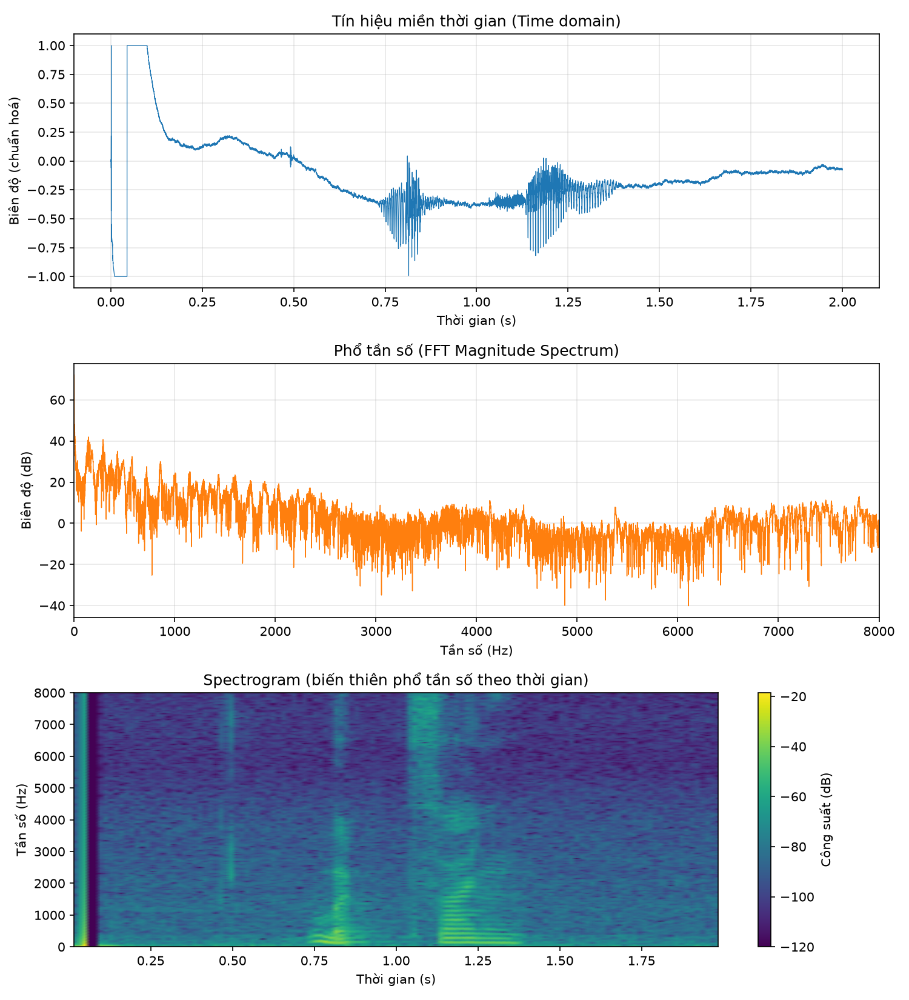
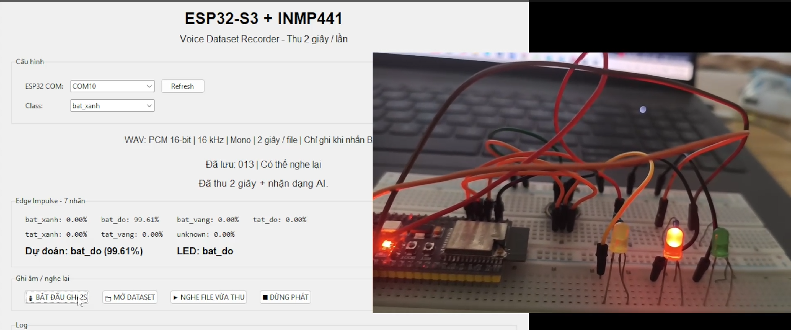
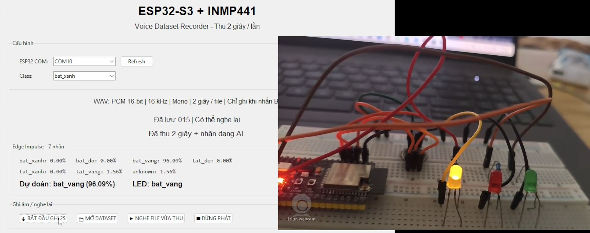
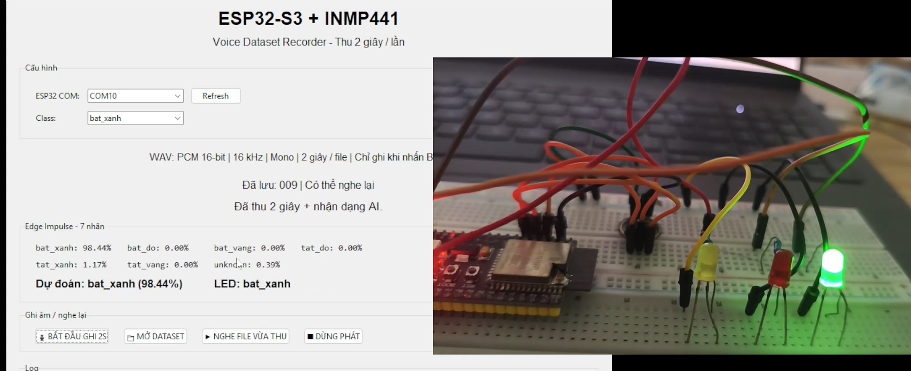

# HỆ THỐNG ĐIỀU KHIỂN LED BẰNG GIỌNG NÓI SỬ DỤNG ESP32-S3

## 1. Giới thiệu

Đề tài xây dựng một hệ thống điều khiển LED bằng giọng nói sử dụng vi điều khiển ESP32-S3 và microphone INMP441.

Âm thanh từ người dùng được thu qua microphone INMP441, sau đó ESP32-S3 xử lý tín hiệu âm thanh và sử dụng mô hình Machine Learning được huấn luyện trên Edge Impulse để nhận diện câu lệnh.

Hệ thống có khả năng nhận diện các lệnh điều khiển LED như:

* `bat_do`
* `tat_do`
* `bat_vang`
* `tat_vang`
* `bat_xanh`
* `tat_xanh`

Sau khi nhận diện câu lệnh, ESP32-S3 thực hiện thao tác tương ứng với LED.

---

## 2. Mục tiêu đề tài

* Thu âm giọng nói bằng microphone INMP441.
* Xử lý tín hiệu âm thanh trên ESP32-S3.
* Xây dựng bộ dữ liệu cho các câu lệnh.
* Huấn luyện mô hình nhận dạng giọng nói bằng Edge Impulse.
* Đưa mô hình AI lên ESP32-S3.
* Điều khiển các LED bằng câu lệnh giọng nói.
* Đánh giá khả năng nhận diện của hệ thống trong thực tế.

---

## 3. Phần cứng

| STT | Thiết bị       | Chức năng                    |
| --- | -------------- | ---------------------------- |
| 1   | ESP32-S3 N16R8 | Vi điều khiển và xử lý AI    |
| 2   | INMP441        | Thu tín hiệu âm thanh        |
| 3   | LED đỏ         | Hiển thị trạng thái LED đỏ   |
| 4   | LED vàng       | Hiển thị trạng thái LED vàng |
| 5   | LED xanh       | Hiển thị trạng thái LED xanh |

---

## 4. Sơ đồ hệ thống


<p align="center">
  
</p>
Hệ thống gồm ba khối chính:

**Microphone INMP441 → ESP32-S3 → Mô hình AI → LED**

Microphone thu âm thanh từ người dùng. ESP32-S3 lấy dữ liệu âm thanh thông qua giao tiếp I2S và đưa dữ liệu vào mô hình nhận dạng giọng nói.

Dựa trên kết quả nhận diện, ESP32-S3 điều khiển LED tương ứng.

---

## 5. Kết nối INMP441

INMP441 được kết nối với ESP32-S3 thông qua giao tiếp I2S.

| INMP441 | ESP32-S3 |
| ------- | -------- |
| VDD     | 3.3V     |
| GND     | GND      |
| SCK     | GPIO 4   |
| WS      | GPIO 5   |
| SD      | GPIO 6   |
| L/R     | GND      |

---

## 6. Bộ dữ liệu

Để xây dựng mô hình nhận dạng giọng nói, bộ dữ liệu được thu thập với các câu lệnh điều khiển tương ứng với ba LED đỏ, vàng và xanh. Các câu lệnh được sử dụng trong quá trình huấn luyện gồm:

* `bat_do` – bật LED đỏ
* `tat_do` – tắt LED đỏ
* `bat_vang` – bật LED vàng
* `tat_vang` – tắt LED vàng
* `bat_xanh` – bật LED xanh
* `tat_xanh` – tắt LED xanh
* `unknown` – các âm thanh hoặc câu lệnh không thuộc các lớp điều khiển trên

Mỗi lớp lệnh điều khiển được thu thập **90 mẫu dữ liệu**, trong khi lớp `unknown` được thu thập **120 mẫu**. Như vậy, tổng số mẫu dữ liệu được sử dụng là:

**6 × 90 + 120 = 660 mẫu**

Chi tiết số lượng dữ liệu của từng lớp được thể hiện trong bảng dưới đây:

| STT | Nhãn | Ý nghĩa | Số lượng mẫu |
|---:|---|---|---:|
| 1 | `bat_do` | Bật LED đỏ | 90 |
| 2 | `tat_do` | Tắt LED đỏ | 90 |
| 3 | `bat_vang` | Bật LED vàng | 90 |
| 4 | `tat_vang` | Tắt LED vàng | 90 |
| 5 | `bat_xanh` | Bật LED xanh | 90 |
| 6 | `tat_xanh` | Tắt LED xanh | 90 |
| 7 | `unknown` | Âm thanh không thuộc các câu lệnh đã định nghĩa | 120 |
| | **Tổng cộng** | | **660** |

Các mẫu âm thanh sau khi thu thập được đưa lên nền tảng **Edge Impulse** để thực hiện quá trình tiền xử lý, trích xuất đặc trưng và huấn luyện mô hình Machine Learning.

Việc bổ sung lớp `unknown` giúp mô hình có khả năng phân biệt các câu lệnh hợp lệ với những âm thanh hoặc câu nói không thuộc các lớp điều khiển, từ đó hạn chế việc hệ thống thực hiện lệnh ngoài ý muốn.

### 6.1 Thông số kỹ thuật của tín hiệu âm thanh thu được

Bảng dưới đây mô tả chi tiết các thông số kỹ thuật của quá trình thu âm bằng microphone INMP441 qua giao tiếp I2S trên ESP32-S3, được cấu hình trực tiếp trong mã nguồn firmware:

| Thông số | Giá trị | Ghi chú |
|---|---|---|
| Tần số lấy mẫu (sample rate) | **16 kHz (16000 Hz)** | Phù hợp với băng thông giọng nói người và giới hạn tài nguyên vi điều khiển |
| Độ phân giải tại tầng thu I2S | **32-bit/mẫu** | INMP441 xuất dữ liệu 24-bit, được căn trái (left-justified) trong khung 32-bit theo chuẩn I2S; ESP32-S3 đọc nguyên khung 32-bit này (`I2S_DATA_BIT_WIDTH_32BIT`) |
| Độ phân giải dữ liệu sau xử lý | **16-bit PCM (int16, có dấu)** | Sau khi đọc khung 32-bit, firmware dịch phải (`>> 14`) và giới hạn (clamp) về khoảng [-32768, 32767] để tạo PCM 16-bit chuẩn — đây là định dạng lưu trong file WAV và đưa vào mô hình Edge Impulse |
| Số kênh | **Mono (1 kênh)** | Chân L/R của INMP441 nối GND → chỉ xuất kênh trái; cấu hình `I2S_SLOT_MODE_MONO` |
| Chuẩn giao tiếp I2S | **Philips I2S Standard** | Sử dụng chế độ `I2S_MODE_STD` của thư viện `ESP_I2S.h` — đây là chuẩn I2S nguyên bản (Philips I2S), dữ liệu truyền dạng MSB-first, bit dữ liệu đầu tiên lệch sau cạnh WS đúng 1 chu kỳ BCLK. Đây **không phải** chế độ Left-Justified (MSB không lệch pha) và cũng không phải chế độ PCM/DSP (dùng khung xung ngắn) |
| Định dạng file lưu | **WAV PCM, 16-bit, mono, 16 kHz** | Tương thích trực tiếp với định dạng dữ liệu âm thanh mà Edge Impulse yêu cầu khi ingest dữ liệu huấn luyện |
| Độ dài mỗi mẫu ghi âm | **2 giây** (32000 mẫu/lần ghi) | `SAMPLE_RATE × RECORD_SECONDS = 16000 × 2 = 32000` |

**Sơ đồ luồng xử lý bit của một mẫu âm thanh:**

```
INMP441 (24-bit audio, căn trái trong khung 32-bit, chuẩn Philips I2S)
        ↓  I2S.begin(I2S_MODE_STD, 16000 Hz, 32-bit, MONO)
Khung dữ liệu I2S 32-bit (int32_t)
        ↓  dịch phải 14 bit (>> MIC_SHIFT), giới hạn [-32768, 32767]
PCM 16-bit (int16_t) — 16000 mẫu/giây
        ↓
File WAV (16-bit PCM, mono, 16kHz)  +  Đầu vào cho Edge Impulse (32000 mẫu / 2 giây)
```

---

## 7. Huấn luyện mô hình bằng Edge Impulse

Quy trình huấn luyện:

1. Thu thập dữ liệu âm thanh.
2. Gán nhãn dữ liệu.
3. Chia dữ liệu thành Training Set và Test Set.
4. Tạo Impulse.
5. Thiết lập Audio / MFCC.
6. Thiết lập Neural Network.
7. Tiến hành Training.
8. Đánh giá độ chính xác.
9. Export mô hình cho ESP32-S3.


<p align="center">
  
</p>

---

## 8. Nguyên lý hoạt động

Khi người dùng phát âm một câu lệnh, microphone INMP441 thu tín hiệu âm thanh.

ESP32-S3 thực hiện:

```text
Thu âm thanh
     ↓
Xử lý tín hiệu I2S
     ↓
Tiền xử lý âm thanh
     ↓
Đưa dữ liệu vào mô hình AI
     ↓
Nhận kết quả phân loại
     ↓
Kiểm tra độ tin cậy
     ↓
Điều khiển LED
```

Ví dụ:

```text
"bật đỏ"
    ↓
Mô hình AI
    ↓
bat_do
    ↓
LED đỏ ON
```

---

## 9. Mã nguồn

Mã nguồn của hệ thống được lưu trong thư mục:

`code/`

Các chương trình kiểm tra phần cứng cũng được lưu riêng để thuận tiện cho việc kiểm thử.

---

## 9.1 Phân tích tín hiệu âm thanh: miền thời gian và miền tần số (FFT)

Để đánh giá chất lượng tín hiệu thu được từ microphone INMP441 trước khi đưa vào huấn luyện mô hình, nhóm thực hiện phân tích một mẫu ghi âm thực tế (ví dụ: câu lệnh `bat_xanh`) trên cả hai miền:

- **Miền thời gian (Time domain):** quan sát biên độ tín hiệu theo thời gian, giúp xác định xem tín hiệu có bị bão hoà (clipping), có khoảng lặng hợp lý trước/sau khi nói, và mức nhiễu nền hay không.
- **Miền tần số (Frequency domain – FFT):** biến đổi Fourier nhanh (Fast Fourier Transform) chuyển tín hiệu từ miền thời gian sang miền tần số, cho biết năng lượng tín hiệu tập trung ở dải tần nào — với giọng nói người, năng lượng chủ yếu nằm trong khoảng 100 Hz – 4 kHz (formant F1, F2, F3), giải thích vì sao tần số lấy mẫu 16 kHz (tần số Nyquist = 8 kHz) là đủ để không mất thông tin theo định lý Nyquist–Shannon.
- **Spectrogram (STFT):** kết hợp cả hai miền — cho thấy phổ tần số biến thiên như thế nào theo thời gian trong suốt câu lệnh, trực quan hoá rõ các âm tiết.

### Công cụ phân tích

Xây dựng script Python (`fft_analysis.py`, dùng thư viện `numpy`, `scipy`, `matplotlib`) để tự động:

1. Đọc file WAV (PCM 16-bit, mono, 16 kHz) từ bộ dữ liệu đã thu.
2. Vẽ đồ thị dạng sóng theo thời gian.
3. Tính FFT (áp dụng cửa sổ Hamming để giảm hiện tượng rò rỉ phổ - *spectral leakage*) và vẽ phổ biên độ theo tần số (0 – 8000 Hz).
4. Tính và vẽ spectrogram bằng phép biến đổi Fourier thời gian ngắn (Short-Time Fourier Transform - STFT).

### Nguyên lí biến đổi của công cụ

Công cụ sử dụng thuật toán **Biến đổi Fourier nhanh (Fast Fourier Transform – FFT)**, cụ thể là thuật toán **Cooley–Tukey** (được cài đặt sẵn trong hàm `numpy.fft.rfft`), để tính **Biến đổi Fourier rời rạc (DFT)** của tín hiệu:

$$X_k = \sum_{n=0}^{N-1} x_n \cdot e^{-i2\pi kn/N}$$

Trong đó `x_n` là N mẫu tín hiệu trong miền thời gian, `X_k` là thành phần phổ phức tại tần số thứ k.

Tính DFT trực tiếp theo công thức trên có độ phức tạp **O(N²)**, nhưng FFT áp dụng chiến lược chia để trị (đệ quy chia đôi bài toán) giúp giảm độ phức tạp xuống còn **O(N log N)** — với N = 32000 mẫu (2 giây, 16 kHz), việc tính toán gần như tức thời.

**Các bước xử lý trong công cụ phân tích:**

1. **Cửa sổ hoá (windowing):** nhân tín hiệu với cửa sổ Hamming để giảm hiện tượng rò rỉ phổ (*spectral leakage*) do đoạn tín hiệu ghi được không tuần hoàn tự nhiên.
2. **Áp dụng FFT:** dùng `rfft` — biến thể tối ưu cho tín hiệu thực (real-valued), chỉ tính nửa phổ dương nhờ tính đối xứng của phổ tín hiệu thực.
3. **Tính biên độ phổ:** lấy trị tuyệt đối của số phức `X_k`, quy đổi sang thang decibel: `20·log10(|X_k|)`.
4. **Ánh xạ trục tần số:** mỗi chỉ số `k` tương ứng với tần số thực `f_k = k · (f_s / N)` (Hz), với `f_s` là tần số lấy mẫu (16000 Hz).

**Đối với spectrogram:** công cụ áp dụng **Biến đổi Fourier thời gian ngắn (Short-Time Fourier Transform – STFT)** bằng hàm `scipy.signal.spectrogram` — chia tín hiệu thành nhiều đoạn nhỏ chồng lấp nhau (cửa sổ Hann, kích thước 512 mẫu, chồng lấp 384 mẫu), tính FFT riêng cho từng đoạn, từ đó thể hiện phổ tần số biến thiên theo thời gian.

### Kết quả minh hoạ

Ảnh dựa trên mẫu bat_xanh_001 của dataset

<p align="center">
  
</p>

**Nhận xét mẫu (điền lại theo kết quả thực tế của nhóm sau khi chạy):**

- Tín hiệu miền thời gian cho thấy phần lặng ở đầu/cuối và phần năng lượng cao tương ứng với lúc phát âm câu lệnh, biên độ PCM nằm trong khoảng cho phép (không bị clipping ở ±32768).
- Phổ FFT cho thấy năng lượng tập trung chủ yếu trong dải tần thấp (dưới ~3–4 kHz), phù hợp với đặc trưng phổ của giọng nói người.
- Spectrogram thể hiện rõ ranh giới giữa khoảng lặng và các âm tiết trong câu lệnh, cũng như sự thay đổi tần số formant theo thời gian.

---

## 10. Kết quả

Hệ thống có thể:

- Thu nhận âm thanh từ INMP441.
- Nhận diện các câu lệnh đã được huấn luyện.
- Điều khiển LED tương ứng.
- Hoạt động trực tiếp trên ESP32-S3.

### 10.1 Mô hình thực tế

<p align="center">
  
</p>

### 10.2 Kết quả điều khiển LED

[LED đỏ hoạt động]

<p align="center">
  
</p>

[LED vàng hoạt động]

<p align="center">
  
</p>

[LED xanh hoạt động]

<p align="center">
  
</p>

---

## 11. Video demo

Video mô phỏng hoạt động của hệ thống:

**[Xem video demo](https://drive.google.com/file/d/1dCzKOaHR7Zo0T2NO3MbgpjVDbt4YbaY8/view?usp=sharing)**

---

## 12. Kết luận

Đề tài đã xây dựng được hệ thống điều khiển LED bằng giọng nói sử dụng ESP32-S3 và microphone INMP441.

Việc sử dụng Edge Impulse giúp xây dựng và triển khai mô hình Machine Learning trên vi điều khiển. Hệ thống có khả năng nhận diện các câu lệnh được huấn luyện và thực hiện thao tác điều khiển LED tương ứng.

---

## 13. Hướng phát triển

Trong tương lai có thể phát triển hệ thống theo các hướng:

* Tăng số lượng câu lệnh.
* Tăng độ chính xác của mô hình.
* Bổ sung nhiều thiết bị điều khiển.
* Điều khiển relay hoặc thiết bị điện.
* Kết hợp Wi-Fi để điều khiển từ xa.
* Kết hợp nhiều loại cảm biến.
* Tối ưu mô hình để giảm thời gian nhận diện.
